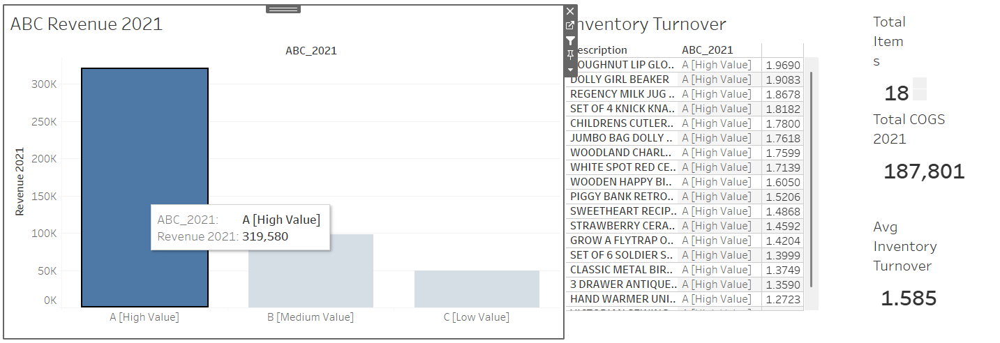
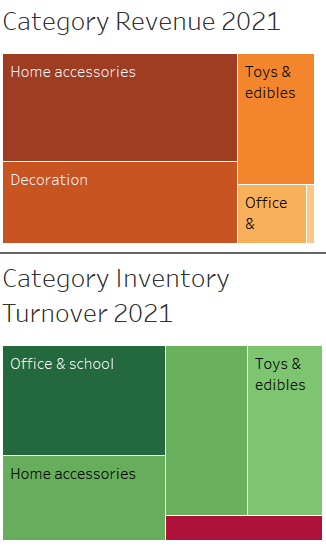
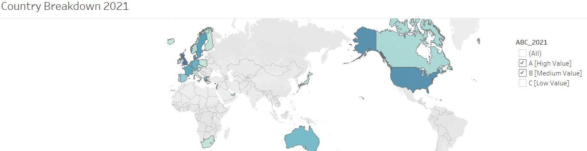

# Retail Inventory Analysis Dashboard in Tableau

### Project Overview

This project analyzes a retail company's inventory dataset across different product categories and countries using Tableau dashboards.
The objective is to optimize inventory management, identify top-performing product classes, and guide future purchasing strategies.

The dataset is fictional but simulates a real-world retail inventory scenario.

### Business Objective

  1. Identify top-performing products (Class A, B, and C) using ABC analysis.

  2. Analyze inventory turnover to evaluate stocking efficiency.

  3. Highlight category and country-level sales patterns for better stock allocation.

  4. Recommend actions to optimize procurement and reduce excess inventory.

Tools Used

  - Tableau

  - Exploratory Data Analysis (EDA)

  - Inventory Turnover Calculation

  - ABC Classification

  - Dashboard Development and Storytelling

### Key Insights

   1. Inventory Turnover:
      High-value (Class A) products have higher turnover rates, suggesting efficient stock movement.
      However, some Class B products have turnover rates close to Class A, indicating opportunities to restock and promote them.
    → Recommendation: Increase Class B inventory stock levels for potential revenue growth.

   2. Revenue Concentration:
      Class A products contributed the majority of 2021 revenue (over 300K USD), heavily outperforming Class B and C items.

   3. Category Breakdown:

     -  Home Accessories and Decoration dominate revenue generation.

     -  Office & School category shows high inventory turnover but low revenue — needs pricing or marketing review.

   4. Home Accessories and Decoration drove the majority of revenue but showed moderate turnover rates, suggesting a need to review inventory levels carefully.

   5. Country Breakdown:
      Orders mainly come from the USA, Canada, and several European countries, suggesting priority regions for inventory focus.
    → Recommendation: Prioritize stocking strategies aligned with these key markets.

   6. COGS & Inventory Stock Changes:
      Inventory sales shifted slightly from Home Accessories to Toys & Edibles between 2020 and 2021.
      Jewelry shows the least stock movement and may require reassessment.
      
   7. Revenue Year-over-Year Comparison:
      Certain products (like Doughnut Lip Gloss and Grow a Flytrap Kit) showed strong YoY revenue gains and should be prioritized.
      Product-Level Analysis showed that top sellers like "Doughnut Lip Gloss" almost doubled their revenue share from 2020 to 2021, indicating strong market trends.

Dashboards & Visuals

   ### ABC Revenue Distribution 2021
   

   ### Category Revenue and Inventory Turnover 2021
   

   ### Country Breakdown of Orders 2021
   

    Category Inventory Turnover Treemap 2021

    Inventory Turnover by Product

    Revenue Comparison 2020 vs. 2021

(See /screenshots folder for full screenshots.)

Project Files

    Inventory Analysis.twbx – Tableau Packaged Workbook containing all dashboards

    /images/ – Key dashboard screenshots for easy viewing

    README.md – Project summary and key insights

### Final Recommendation

Through this analysis, procurement and inventory teams can make smarter decisions:

    Scale stock for fast-moving Class B products.

    Focus purchases on high-turnover categories like Office & School.

    Monitor underperforming categories (e.g., Jewelry) for potential de-prioritization.

    Align purchasing strategy geographically toward high-demand countries like the USA and European regions.

***** This project uses a simulated retail inventory dataset for learning and demonstration purposes.

## 📈 Key Metrics Tracked

| Metric                    | Description                                           |
|----------------------------|-------------------------------------------------------|
| Revenue 2020 vs. 2021      | Product-level revenue growth comparison              |
| Inventory Turnover Rate    | Efficiency of inventory movement                     |
| ABC Classification         | Product revenue contribution analysis                |
| Category Performance       | Revenue and turnover by product category             |
| Geographic Performance     | Orders by country                                     |

## 🛠️ How to Open the Project

1. Download `Inventory Analysis.twbx` from this repository.
2. Open it using Tableau Desktop or Tableau Public.
3. Explore the dashboards and interact with filters to view insights across categories and countries.
